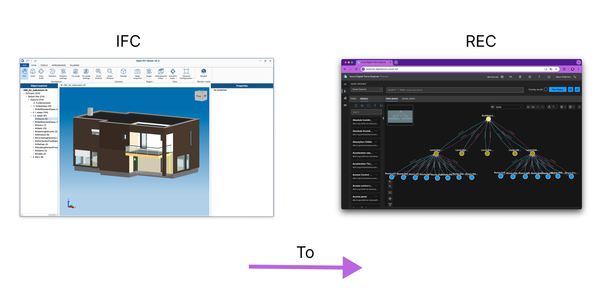

# Demohuset into Azure Digital Twins

We are building out this tutorial to demonstrate how one can create a digital twins environment using Azure Digital Twin. Often there are issues in reusing and connecting the "static" IFC models in a dynamic twin environment. This tutorial aims to show exactly how to go about doing that.

## The 01_Topology part takes the spatial structure of an Architecture model into Azure Digital Twins

## Getting started

Clone repo and open in vscode. Make sure you have the devcontainer addon and docker on your computer.

Vscode should identify the devcontainer config and promt to reopen in container. The devcontainer should be built and opened.

When the devcontainer initially builds, i.e. opens for the first time, it will run the `$ post-create.sh` script to download and install the required dependencies.
